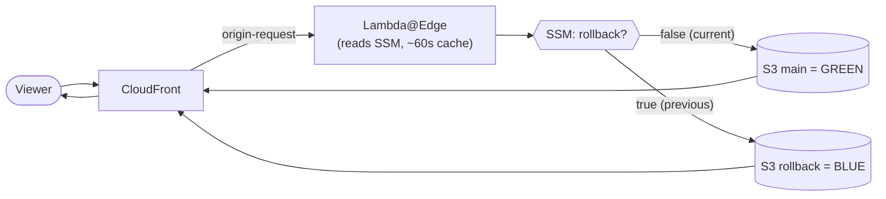

# CloudFront Blue/Green — Static Site Stack with Instant Rollback

> 🌐 **Languages:** **English** · [Português (Brasil)](./docs/pt-br/README.md)

A Terraform stack for hosting static sites on **Amazon CloudFront + S3**, built around a
**blue/green deployment** pattern: when a release goes wrong, you roll back to the previous
version **instantly — with one click and no new build**.

Instead of re-deploying an old artifact or restoring files by hand, you flip a single switch
(an SSM Parameter Store value) and a **Lambda@Edge** function transparently re-points
CloudFront to the previous version, which was kept warm in a second S3 bucket. You can also
keep an archive of **every** build and restore any historical version on demand.

It also provisions — all optional — Route 53 records, ACM certificates for custom domains,
public **or** private buckets, and a complete **GitHub Actions CI/CD pipeline** authenticated
via **OIDC (no long-lived access keys)**.

---

## 📚 Documentation map

**Overwhelmed?** Start here → Pick your scenario in the [Quick Start](#-quick-start-choose-your-demo) section, click the demo link, follow 5-10 minutes of hands-on commands.

This README is the middle ground: enough to understand the project and get going. From here,
two paths:

| If you want to… | Go to |
|---|---|
| **Just use it, fast** | ⚡ Quickstart — [English](./docs/en/quickstart.md) · [Português](./docs/pt-br/quickstart.md) |
| **See all configuration examples** (9 ready-to-use .tfvars files) | 📋 [Test Examples & Scenarios](./docs/TEST_EXAMPLES.md) — Simple, Rollback, Versioning |
| **Understand every detail** (variables, OAC vs website, OIDC, gotchas) | 📖 Complete guide — [English](./docs/en/full-guide.md) · [Português](./docs/pt-br/full-guide.md) |
| **See AWS architecture** | 🎨 [`docs/architecture.drawio`](./docs/architecture.drawio) (open in [draw.io](https://app.diagrams.net) or the VS Code *Draw.io* extension) |
| **A demo site to test the whole flow** | 🧪 [`bluegreen_site/`](./bluegreen_site/README.md) |
| **Run rapid demonstrations** (3 pre-configured stacks) | 🚀 Demo Guide — [English](./docs/en/DEMO.md) · [Português](./docs/pt-br/DEMO.md) — 5, 8, or 10 min demos |
| **How GitHub Actions workflows work** (auto-generated, OIDC auth) | 🤖 Workflows Guide — [English](./docs/en/WORKFLOWS.md) · [Português](./docs/pt-br/WORKFLOWS.md) — Reference & examples |

---

## 🚀 Quick Start: Choose Your Demo

Not sure which setup you need? **Choose based on your requirements:**

### 1️⃣ Simple Stack (5 minutes)
**File:** [`terraform-simple-demo.tfvars`](./terraform-simple-demo.tfvars)

```
✅ CloudFront + S3
❌ No rollback
❌ No version history
💰 ~$0.50-2/month
```

**When to use:** Quick deployments, MVPs, simple static sites, learning

**Try it:**
```bash
terraform plan -var-file=terraform-simple-demo.tfvars
```

---

### 2️⃣ Blue-Green Rollback (8 minutes)
**File:** [`terraform-rollback-demo.tfvars`](./terraform-rollback-demo.tfvars)

```
✅ CloudFront + 2 S3 buckets
✅ Instant rollback (one click)
❌ No version history
💰 ~$2-5/month
```

**When to use:** Production sites, zero-downtime deploys, need instant rollback

**Try it:**
```bash
terraform plan -var-file=terraform-rollback-demo.tfvars
```

---

### 3️⃣ Full Versioning (10 minutes)
**File:** [`terraform-versioning-demo.tfvars`](./terraform-versioning-demo.tfvars)

```
✅ CloudFront + 3 S3 buckets
✅ Instant rollback (one click)
✅ Restore ANY historical version
💰 ~$3-8/month
```

**When to use:** Mission-critical apps, audit requirements, disaster recovery, full history

**Try it:**
```bash
terraform plan -var-file=terraform-versioning-demo.tfvars
```

---

### 📊 Side-by-Side Comparison

| Feature | Simple | Rollback | Versioning |
|---------|--------|----------|-----------|
| CloudFront + S3 | ✅ | ✅ | ✅ |
| Instant Rollback | — | ✅ | ✅ |
| Version History | — | — | ✅ |
| Restore Any Version | — | — | ✅ |
| Lambda@Edge | — | ✅ | ✅ |
| Setup Time | 5 min | 8 min | 10 min |
| Monthly Cost | ~$1 | ~$3 | ~$5 |

**👉 See detailed demos with step-by-step instructions:**
- 🌐 **English:** [docs/en/DEMO.md](./docs/en/DEMO.md)
- 🇧🇷 **Português:** [docs/pt-br/DEMO.md](./docs/pt-br/DEMO.md)

---

## 📝 Configuring Your Own Stack

All demo files include **heavily commented explanations** of every setting. To customize:

1. **Copy one of the demo files** as a starting point:
   ```bash
   cp terraform-simple-demo.tfvars terraform.tfvars
   ```

2. **Edit the variables.** Each setting is documented inline. For complete documentation of all options, see:
   - 📖 **All variables explained:** [`docs/en/full-guide.md#configuration`](./docs/en/full-guide.md)
   - 📊 **Variable reference:** Check the comments in `variables.tf` for validation rules

3. **Key sections to customize:**
   - `region` — AWS region (must be `us-east-1` for CloudFront + Lambda@Edge)
   - `buckets` — S3 bucket names and modes (OAC vs website, rollback, versioning)
   - `cloudfront` — Caching rules, custom domains, error responses
   - `lambda_edge` — Enable rollback toggle
   - `route53` — Custom domains
   - `acm` — SSL certificates
   - `gha_gen_workflows` — GitHub Actions integration

---

## How it works

The core is a **Lambda@Edge function on CloudFront's `origin-request` event**. On each request
to the origin, it:

1. Reads an SSM parameter (default `/Lambda/CF/Rollback`), value `"true"` or `"false"`
   (cached in the Lambda for ~60s to avoid an SSM call per request).
2. Picks the origin: `"false"` → **main** bucket (current version); `"true"` → **rollback**
   bucket (previous version); anything unexpected → falls back to main.
3. Rewrites the request origin to that bucket — an **S3 origin** (private/OAC) or a **custom
   HTTP origin** (public/website).



**Deploy** keeps the buckets in sync: it copies the current main bucket into the rollback
bucket (preserving the previous version), builds, uploads the new version to main, ensures
the toggle is `false`, and invalidates the cache.

**Rollback** is then a single click: the rollback workflow flips the toggle to `"true"` and
invalidates — within the Lambda cache TTL (~60s) CloudFront serves the preserved previous
version. No build, no re-upload.

> 🎨 See AWS Archtecture [`docs/architecture.drawio`](./docs/architecture.drawio).

---

## Deployment modalities

Selected with `gha_gen_workflows.workflow_option`. It decides both the AWS resources you
provision and the GitHub Actions workflows that get generated.

| Modality | What it provisions | Rollback | Restore by commit | Generated workflows |
|---|---|:---:|:---:|---|
| **`simple-deploy`** | CloudFront + 1 bucket | — | — | `deploy.yml` |
| **`deploy-and-rollback`** | + rollback bucket + Lambda@Edge + SSM | ✅ instant | — | `deploy.yml`, `rollback.yml` |
| **`deploy-rollback-and-restore`** | + versions bucket (`.tar.gz` per commit) | ✅ instant | ✅ any version | `deploy.yml`, `rollback-and-restore.yml` |

The third modality archives every build as `<commit-sha>.tar.gz`, so you can restore **any**
historical version by its commit hash — not only the immediately previous one. Full details
and per-modality `tfvars` examples are in the
[complete guide](./docs/en/full-guide.md#the-three-deployment-modalities).

---

## 🤖 GitHub Actions Workflows

Workflows are **auto-generated by Terraform** based on your `workflow_option`. Each modality creates different workflows:

| Modality | Workflows Generated |
|----------|-------------------|
| `simple-deploy` | `deploy.yml` |
| `deploy-and-rollback` | `deploy.yml`, `rollback.yml` |
| `deploy-rollback-and-restore` | `deploy.yml`, `rollback-and-restore.yml` |

### Key Points

✅ **Auto-generated:** Terraform creates workflows from templates  
✅ **OIDC auth:** No long-lived AWS keys — GitHub ↔ AWS trust relationship  
✅ **Least-privilege:** Workflows only access your specific resources  
✅ **Regenerated on apply:** Running `terraform apply` updates workflows to match config  

⚠️ **Important:** Don't edit workflows manually in `.github/workflows/` — they're regenerated on each `terraform apply`. Instead, customize via `terraform.tfvars` or edit module templates.

**👉 Full reference:** [Workflows Guide](./docs/en/WORKFLOWS.md) · [Guia de Workflows](./docs/pt-br/WORKFLOWS.md)

---

## Key features

- 🟦🟩 **Instant, one-click blue/green rollback** (Lambda@Edge + SSM toggle, no rebuild).
- 🗄️ **Version archive & restore** of any build, by commit hash (optional third bucket).
- 🔒 **Public or private origins**: S3 website hosting **or** CloudFront OAC — the Lambda is
  rendered from the matching template automatically.
- 🌍 **Custom domain ready**: optional Route 53 records + ACM certificate (single or wildcard).
- 🤖 **Auto-generated GitHub Actions workflows** tailored to the chosen modality.
- 🔑 **Keyless CI/CD via OIDC**: a GitHub↔AWS trust relationship replaces static keys, with a
  least-privilege policy scoped to exactly your buckets, parameter, and distribution.

---

## Using it

The fast path lives in the **[Quickstart](./docs/en/quickstart.md)**. In short:

1. **Create a `terraform.tfvars`** describing your buckets, CloudFront, Lambda mode, domain
   and GitHub repo. (Ready-made examples per modality:
   [complete guide → examples](./docs/en/full-guide.md#configuration-examples-tfvars).)
2. **Provision:**
   ```bash
   terraform init
   terraform plan
   terraform apply
   ```
   This creates the AWS resources **and** writes the workflows into `.github/workflows`.
3. **Commit the generated workflows** to your repository.
4. **Trigger a deploy** — push to the deploy branch (default `main`) or run the **Deploy**
   workflow manually. It assumes the IAM role via OIDC, builds, uploads to S3, invalidates.
5. **Roll back anytime** by running the **Rollback** workflow (one click).

> 🧪 Want to validate end-to-end first? The [`bluegreen_site/`](./bluegreen_site/README.md)
> demo is a single self-contained HTML page; the
> [Quickstart](./docs/en/quickstart.md#testing-the-full-flow-with-the-demo) walks through a
> deploy → deploy → rollback → restore cycle with it.

### Requirements

- **Terraform ≥ 1.5**, **AWS provider ~> 6.33**.
- An **AWS account**, with the stack deployed in **`us-east-1`** (required by CloudFront's
  ACM certificate and Lambda@Edge).
- A **GitHub repository** for the generated CI/CD; a **Route 53 hosted zone** for custom domains.

---

## Repository structure

```text
.
├── README.md               # You are here — the main, middle-ground doc
├── *.tf                     # Root stack: S3, CloudFront, Lambda@Edge, ACM, Route 53, outputs
├── lambda/                  # Lambda@Edge templates: oac/ (private) and s3_website/ (public)
├── modules/gha_gen_workflows/  # OIDC + IAM + GitHub Actions workflow generator
├── bluegreen_site/          # Self-contained demo static site
└── docs/
    ├── architecture.drawio  # AWS Architecture diagram (draw.io)
    ├── en/  {quickstart.md, full-guide.md}
    └── pt-br/  {README.md, quickstart.md, full-guide.md}
```

A file-by-file breakdown is in the
[complete guide → repository structure](./docs/en/full-guide.md#repository-structure).

---

## Good to know

A few constraints worth keeping in mind (the
[complete guide](./docs/en/full-guide.md#conventions-constraints--gotchas) explains each):

- **Deploy in `us-east-1`** (CloudFront ACM + Lambda@Edge requirement).
- **Exactly one production bucket** (`main_bucket = true`, `versions_bucket = false`) — its
  name can be anything; a validation enforces this.
- A bucket is **either** public (`website = true`) **or** private (`origin_access_control = true`),
  never both, and `lambda_edge.cf_access_bucket_mode` must match.
- For a **custom domain**, use ACM (`acm.create = true`) and set the CloudFront default
  certificate to `false`.
- Rollback propagation ≈ Lambda cache TTL (~60s) + invalidation time — fast, not literally instant.

---

## Use cases

- **Marketing / landing / docs sites** that must never stay "stuck broken".
- **SPAs** (React/Vue/Angular) wanting safe, frequent deploys with a fast escape hatch.
- **Teams adopting keyless CI/CD** (OIDC) instead of managing AWS access keys.
- **Audited environments** that benefit from an immutable archive of every build and exact
  per-commit restores.

---

> 📖 Dig deeper in the complete guide ([EN](./docs/en/full-guide.md) ·
> [PT](./docs/pt-br/full-guide.md)) · ⚡ or get going with the quickstart
> ([EN](./docs/en/quickstart.md) · [PT](./docs/pt-br/quickstart.md)).
