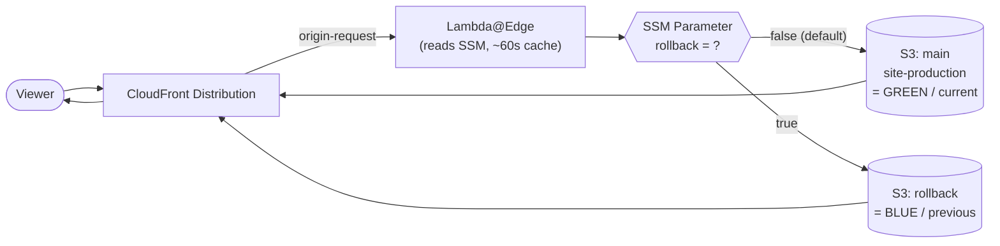
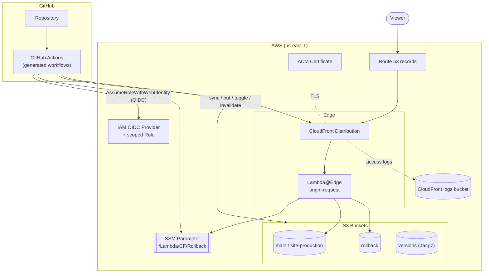

# CloudFront Blue/Green — Static Site Stack with Instant Rollback

> 📖 **Complete guide** · 🌐 **Languages:** **English** · [Português (Brasil)](../pt-br/full-guide.md)
> · ⬅️ Back to the [main README](../../README.md) · ⚡ In a hurry? [Quickstart](./quickstart.md)

A Terraform stack for hosting static sites on **Amazon CloudFront + S3**, designed
around a **blue/green deployment pattern** that makes **rolling back a release
instant — with no new build required**.

Instead of re-deploying an old artifact when something breaks in production, you
flip a single switch (an SSM Parameter Store value) and a **Lambda@Edge** function
transparently re-points CloudFront to the *previous* version that was preserved in
a second S3 bucket. Optionally, you can also keep an archive of **every** build
(packaged by commit hash) and restore any arbitrary historical version on demand.

The stack also provisions — all optional and configurable — Route 53 DNS records,
ACM certificates for custom domains, public (S3 website) **or** private (OAC) bucket
access, and a complete **GitHub Actions CI/CD pipeline** authenticated through **OIDC
(no long-lived AWS access keys)**.

---

## Table of contents

1. [Why this project](#why-this-project)
2. [Key features](#key-features)
3. [How blue/green works here](#how-bluegreen-works-here)
4. [The three deployment modalities](#the-three-deployment-modalities)
5. [Architecture](#architecture)
6. [Bucket access modes: public (website) vs private (OAC)](#bucket-access-modes-public-website-vs-private-oac)
7. [GitHub Actions + OIDC (keyless CI/CD)](#github-actions--oidc-keyless-cicd)
8. [Repository structure](#repository-structure)
9. [Requirements](#requirements)
10. [Getting started](#getting-started)
11. [Configuration examples (`tfvars`)](#configuration-examples-tfvars)
12. [Day-2 operations: deploy, rollback, restore](#day-2-operations-deploy-rollback-restore)
13. [Variable reference](#variable-reference)
14. [Outputs](#outputs)
15. [Conventions, constraints & gotchas](#conventions-constraints--gotchas)
16. [Use cases](#use-cases)
17. [Suggested enhancements / roadmap](#suggested-enhancements--roadmap)

---

## Why this project

A "plain" CloudFront + S3 setup is great for serving static sites, but rolling back
a bad release usually means one of:

- re-running the previous build and re-uploading it (slow, and assumes the old build
  is still reproducible), or
- restoring an S3 object version manually (error-prone, file-by-file), or
- accepting downtime while you scramble.

This stack treats **rollback as a first-class, instant operation**:

- The **previous live version is always kept warm** in a dedicated bucket.
- Switching between "current" and "previous" is a **single parameter flip** —
  no build, no re-upload of the rollback target.
- Propagation is bounded by a short Lambda cache TTL (~60s) plus a CloudFront
  invalidation, so recovery is measured in **seconds to a couple of minutes**.

On top of that, it packages the operational tooling (CI/CD workflows + least-privilege
IAM) so a team can adopt the whole pattern by setting a handful of Terraform variables.

---

## Key features

- 🟦🟩 **Instant blue/green rollback** driven by a Lambda@Edge `origin-request`
  function + SSM Parameter Store toggle — **no rebuild needed**.
- 🗄️ **Version archive & restore** (optional third bucket): every build is stored as
  a `commit-hash.tar.gz`, so you can restore **any** historical version, not just the
  immediately previous one.
- 🔁 **Three provisioning modalities** with progressively richer capabilities
  (simple → rollback → rollback + restore), each rendering exactly the resources and
  workflows it needs.
- 🔒 **Public or private origins**: serve buckets publicly via S3 website hosting, or
  privately via CloudFront **Origin Access Control (OAC)**. The Lambda is rendered from
  the matching template automatically.
- 🌍 **Custom domain ready**: optional Route 53 records + ACM certificate (single host
  or wildcard) wired into the CloudFront distribution.
- 🤖 **Auto-generated GitHub Actions workflows** tailored to the chosen modality
  (deploy / rollback / restore), written straight into your repo's `.github/workflows`.
- 🔑 **Keyless CI/CD via OIDC**: a GitHub↔AWS trust relationship (OIDC provider + IAM
  role) replaces static access keys; the attached policy is **scoped to exactly** the
  buckets, parameter, and distribution involved.
- 🧱 **Highly parameterized CloudFront**: cache behaviors, ordered behaviors, custom
  error responses, geo restrictions, logging, price class, HTTP version, WAF, etc.

---

## How blue/green works here

The heart of the pattern is a **Lambda@Edge function attached to the CloudFront
`origin-request` event**. On every request that reaches the origin, the function:

1. Reads a boolean-ish SSM Parameter (default name `/Lambda/CF/Rollback`), value
   `"true"` or `"false"`. The value is **cached in the Lambda for ~60s**
   (`CACHE_TTL_MS`) to avoid an SSM call on every request.
2. Chooses the origin:
   - `"false"` → **main / production** bucket (the *green*, current version).
   - `"true"` → **rollback** bucket (the *blue*, previous version).
   - any unexpected value → falls back to the main bucket.
3. Rewrites `request.origin` (and the `Host` header) to point CloudFront at the chosen
   bucket — using an **S3 origin** (OAC mode) or a **custom HTTP origin** (website mode).



**Deploy** (happy path) keeps the buckets in sync like this:

1. Copy the **current** main bucket content into the **rollback** bucket (this becomes
   the "previous version" you can fall back to).
2. Build and upload the **new** version into the **main** bucket.
3. Ensure the rollback toggle is `"false"` (serving the new version).
4. Invalidate the CloudFront cache.

**Rollback** is then just: set the toggle to `"true"` + invalidate. CloudFront starts
serving the preserved previous version within the Lambda cache TTL — **no build, no
re-upload**.

> The Terraform `aws_ssm_parameter.rollback` uses `ignore_changes = [value]`, so
> flipping the toggle from CI/CD (or by hand) never shows up as Terraform drift.

---

## The three deployment modalities

The modality is selected with `gha_gen_workflows.workflow_option` and determines both
the **AWS resources** you should provision and the **GitHub Actions workflows** that
get generated.

| Capability | `simple-deploy` | `deploy-and-rollback` | `deploy-rollback-and-restore` |
|---|:---:|:---:|:---:|
| Main (production) bucket | ✅ | ✅ | ✅ |
| Rollback bucket | — | ✅ | ✅ |
| Versions archive bucket | — | — | ✅ |
| Lambda@Edge + SSM toggle | — | ✅ | ✅ |
| Instant rollback to previous version | — | ✅ | ✅ |
| Restore **any** historical version (by commit hash) | — | — | ✅ |
| Generated workflows | `deploy.yml` | `deploy.yml`, `rollback.yml` | `deploy.yml`, `rollback-and-restore.yml` |

### 1. `simple-deploy`
A conventional single-bucket CloudFront + S3 site. One workflow builds, uploads to S3,
and invalidates the cache. No Lambda, no rollback machinery. Good baseline / for sites
that don't need fast rollback.

### 2. `deploy-and-rollback`
Adds the **rollback** bucket, the **Lambda@Edge** function, and the **SSM toggle**. The
deploy workflow preserves the previous version before shipping the new one; a separate
`rollback.yml` flips the toggle to instantly serve the previous version.

### 3. `deploy-rollback-and-restore`
Everything above **plus** a **versions** bucket. Every deploy also packages the build as
`<commit-sha>.tar.gz` and stores it in the versions bucket. The `rollback-and-restore.yml`
workflow offers two paths:

- **Toggle rollback** (serve the immediately previous version), or
- **Restore a specific version** by providing its commit hash — the workflow downloads
  that archive, repopulates the main bucket, sets the toggle to `false`, and invalidates.

---

## Architecture



**Provider / region.** This stack is designed to run in **`us-east-1`**, because
CloudFront's ACM certificate and Lambda@Edge functions must live in that region, and the
Lambda reads SSM from `us-east-1`. See [Conventions, constraints & gotchas](#conventions-constraints--gotchas).

---

## Bucket access modes: public (website) vs private (OAC)

Each bucket declares **how CloudFront reaches it**, and the whole stack adapts:

| Mode | Bucket flag | CloudFront origin | Lambda template | Public access |
|---|---|---|---|---|
| **OAC** (recommended, private) | `origin_access_control = true` | S3 origin + Origin Access Control | `lambda/oac/index.js.tpl` | Bucket blocked from public; only CloudFront can read it (SigV4 + `AWS:SourceArn` condition). |
| **Website** (public) | `website = true` | Custom HTTP origin to the S3 website endpoint | `lambda/s3_website/index.js.tpl` | Bucket has a public `s3:GetObject` policy + website hosting. |

A bucket must pick **exactly one** of the two — a validation enforces that `website` and
`origin_access_control` cannot hold the same value. The Lambda template is chosen via
`lambda_edge.cf_access_bucket_mode` (`"oac"` or `"s3_website"`), and Terraform
preconditions ensure the Lambda mode matches the buckets' access mode.

- **OAC mode** rewrites the origin to an **S3 origin** (`request.origin.s3`).
- **Website mode** rewrites it to a **custom HTTP origin** (`request.origin.custom`,
  port 80, `http-only`) pointing at the S3 website endpoint.

---

## GitHub Actions + OIDC (keyless CI/CD)

The `gha_gen_workflows` module provisions the CI/CD layer with **no static credentials**:

- **OIDC provider** for `token.actions.githubusercontent.com` (the SHA-1 thumbprint is
  fetched dynamically from GitHub's live certificate via the `tls` provider, so it never
  goes stale).
- **IAM role** with a **trust policy restricted to your repository**
  (`repo:<org>/<repo>:*` — any branch/tag/PR of that repo only) that can be assumed via
  `sts:AssumeRoleWithWebIdentity`.
- **Least-privilege policy** scoped to exactly:
  - the **active buckets** for the chosen modality (`s3:ListBucket`, `GetObject`,
    `PutObject`, `DeleteObject`),
  - the **specific SSM parameter** (`PutParameter`/`GetParameter…`),
  - the **specific CloudFront distribution** (`CreateInvalidation`/`GetInvalidation`/
    `ListInvalidations`).
- **Workflow files written into your repo** at `workflows_output_path`
  (default `.github/workflows`), rendered from templates for the chosen modality.

Every generated workflow authenticates with `aws-actions/configure-aws-credentials@v4`
using `role-to-assume: <generated role ARN>` and `permissions: id-token: write`.

---

## Repository structure

```text
.
├── main.tf                 # Terraform + AWS/random providers, default tags
├── variables.tf            # Root input variables (+ validations & preconditions)
├── locals.tf               # Bucket classification (main/rollback/versions, oac/website)
├── data.tf                 # aws_caller_identity
├── s3.tf                   # Buckets, policies, public-access blocks, logging bucket
├── cloudfront.tf           # OAC + CloudFront distribution (origins, behaviors, Lambda assoc.)
├── lambda_edge.tf          # Lambda@Edge packaging, IAM role/policy, SSM parameter
├── acm.tf                  # ACM certificate + DNS validation records
├── route53.tf              # Route 53 alias A records for the distribution
├── outputs.tf              # cloudfront_urls
├── gha_workflows.tf        # Wires the gha_gen_workflows module
│
├── lambda/
│   ├── oac/index.js.tpl        # Lambda template for private (OAC) origins
│   └── s3_website/index.js.tpl # Lambda template for public (website) origins
│
├── modules/
│   └── gha_gen_workflows/
│       ├── variables.tf        # Module inputs
│       ├── oidc.tf             # GitHub OIDC provider
│       ├── iam_role.tf         # Repo-scoped trust + role
│       ├── iam_policy.tf       # Least-privilege deploy policy
│       ├── templates.tf        # Renders workflows based on workflow_option
│       ├── validations.tf      # Cross-variable checks (required buckets)
│       ├── outputs.tf          # Role/provider/policy ARNs + generated file paths
│       ├── versions.tf         # Provider/version constraints
│       └── templates/          # Workflow templates (.yml.tpl)
│           ├── simple-deploy.yml.tpl
│           ├── deploy-with-rollback-backup.yml.tpl
│           ├── rollback-toggle.yml.tpl
│           ├── deploy-with-versioning.yml.tpl
│           └── rollback-and-restore.yml.tpl
│
└── bluegreen_site/         # Self-contained demo static site for testing the pipeline
    ├── package.json
    ├── README.md
    └── src/index.html
```

---

## Requirements

- **Terraform** `>= 1.5.0` (the workflows module uses `check` blocks).
- **AWS provider** `~> 6.33` (root); module is compatible with `>= 5.0`.
- An **AWS account** with permission to create CloudFront, S3, Lambda, IAM, SSM, ACM,
  and Route 53 resources.
- **`us-east-1`** as the deployment region (CloudFront ACM + Lambda@Edge requirement).
- A **GitHub repository** (org + repo name) if you want the generated CI/CD.
- For custom domains: a **Route 53 hosted zone** for your domain.

---

## Getting started

1. **Create a `terraform.tfvars`** (see [examples below](#configuration-examples-tfvars))
   describing your buckets, CloudFront settings, Lambda mode, domain, and GitHub repo.

2. **Initialize and review:**
   ```bash
   terraform init
   terraform plan
   ```

3. **Apply:**
   ```bash
   terraform apply
   ```
   This provisions the AWS resources **and** writes the GitHub Actions workflow files
   into `workflows_output_path` (default `.github/workflows`).

4. **Commit the generated workflows** to your GitHub repository.

5. **Trigger the deploy** — push to your deploy branch (default `main`) or run the
   `Deploy` workflow manually (`workflow_dispatch`). The workflow assumes the IAM role via
   OIDC, builds, uploads to S3, and invalidates CloudFront.

6. **Browse your site** at the distribution domain (see the `cloudfront_urls` output) or
   your custom domain.

> 💡 Want a ready-made site to validate the pipeline end-to-end? Use the
> [`bluegreen_site/`](../../bluegreen_site/README.md) demo — a single self-contained HTML
> page with a trivial `npm run build` that just copies `src/` into `dist/`.

---

## Configuration examples (`tfvars`)

### A) Private origins (OAC) + custom domain + full rollback & restore

```hcl
region = "us-east-1"

buckets = [
  {
    name                  = "site-production" # main bucket — any name works (see gotchas)
    main_bucket           = true
    origin_access_control = true
    website               = false
    force_destroy         = true
  },
  {
    name                  = "site-rollback"
    main_bucket           = false
    origin_access_control = true
    website               = false
    force_destroy         = true
  },
  {
    name                  = "site-versions"
    main_bucket           = false
    versions_bucket       = true
    origin_access_control = true
    website               = false
    versioning            = true
    force_destroy         = true
  },
]

lambda_edge = {
  enabled               = true
  cf_access_bucket_mode = "oac"
}

cloudfront = {
  enabled             = true
  default_root_object = "index.html"
  aliases             = ["app.example.com"]

  viewer_certificate = {
    cloudfront_default_certificate = false # using ACM custom cert
    ssl_support_method             = "sni-only"
  }

  default_cache_behavior = {
    allowed_methods        = ["GET", "HEAD"]
    cached_methods         = ["GET", "HEAD"]
    viewer_protocol_policy = "redirect-to-https"
    min_ttl                = 0
    default_ttl            = 3600
    max_ttl                = 86400
    forwarded_values = {
      query_string = false
      cookies      = { forward = "none" }
    }
  }

  restrictions          = { geo_restriction = { restriction_type = "none" } }
  custom_error_response = [
    { error_code = 403, response_page_path = "/index.html", response_code = 200, error_caching_min_ttl = 0 },
    { error_code = 404, response_page_path = "/index.html", response_code = 200, error_caching_min_ttl = 0 },
  ]
}

acm = {
  create            = true
  wildcard          = false
  validation_method = "DNS"
}

route53 = {
  enabled = true
  domain  = "example.com"
}

gha_gen_workflows = {
  github_org       = "my-org"
  github_repo      = "my-repo"
  workflow_option  = "deploy-rollback-and-restore"
  build_command    = "npm ci && npm run build"
  build_output_dir = "./dist"
  deploy_branch    = "main"
}
```

### B) Public origins (S3 website) + default CloudFront certificate + simple rollback

Key differences: buckets use `website = true` / `origin_access_control = false`, the
Lambda mode is `s3_website`, the CloudFront default certificate is used (no ACM/Route 53),
and the modality is `deploy-and-rollback` (no versions bucket).

```hcl
region = "us-east-1"

buckets = [
  { name = "site-production", main_bucket = true,  website = true, origin_access_control = false, force_destroy = true },
  { name = "site-rollback",   main_bucket = false, website = true, origin_access_control = false, force_destroy = true },
]

lambda_edge = {
  enabled               = true
  cf_access_bucket_mode = "s3_website"
}

cloudfront = {
  enabled             = true
  default_root_object = "index.html"

  viewer_certificate = {
    cloudfront_default_certificate = true
  }

  default_cache_behavior = {
    allowed_methods        = ["GET", "HEAD"]
    cached_methods         = ["GET", "HEAD"]
    viewer_protocol_policy = "redirect-to-https"
    min_ttl                = 0
    default_ttl            = 3600
    max_ttl                = 86400
    forwarded_values = {
      query_string = false
      cookies      = { forward = "none" }
    }
  }

  restrictions          = { geo_restriction = { restriction_type = "none" } }
  custom_error_response = []
}

acm     = { create = false }
route53 = { enabled = false }

gha_gen_workflows = {
  github_org       = "my-org"
  github_repo      = "my-repo"
  workflow_option  = "deploy-and-rollback"
  build_command    = "npm ci && npm run build"
  build_output_dir = "./dist"
}
```

> For a **`simple-deploy`** site you only need the single `site-production` bucket and can
> set `lambda_edge.enabled = false`; set `gha_gen_workflows.workflow_option = "simple-deploy"`.

---

## Day-2 operations: deploy, rollback, restore

### Deploy
Push to the deploy branch (or run **Deploy** via `workflow_dispatch`). The workflow:
copies the current main bucket → rollback bucket, builds, uploads the new build to the
main bucket, ensures the toggle is `false`, and invalidates CloudFront.
(In `deploy-rollback-and-restore`, it additionally archives `<commit>.tar.gz` to the
versions bucket.)

### Rollback to the previous version (instant, no build)
Run the **Rollback** workflow (`deploy-and-rollback`) or **Rollback and Restore** with
*Restore a specific version* **unchecked** (`deploy-rollback-and-restore`). It sets the
SSM toggle to `"true"` and invalidates the cache. Within the Lambda cache TTL (~60s),
CloudFront serves the preserved previous version from the rollback bucket.

### Restore a specific historical version (only `deploy-rollback-and-restore`)
Run **Rollback and Restore**, check *Restore a specific version*, and provide the
**commit hash**. The workflow validates the archive exists, downloads
`<commit>.tar.gz` from the versions bucket, empties and repopulates the main bucket with
that version, sets the toggle back to `"false"`, and invalidates the cache.

> To return from a rollback to "current" again, just run a normal deploy (it sets the
> toggle back to `false`).

---

## Variable reference

### Root module

| Variable | Type / key fields | Default | Description |
|---|---|---|---|
| `region` | `string` | — | AWS region. Use `us-east-1` (see gotchas). |
| `buckets` | `list(object)` | — | Buckets to create. Per bucket: `name`, `main_bucket` (required); `versions_bucket`, `website`, `origin_access_control`, `versioning`, `force_destroy`, `index_document`, `error_document` (optional). Validation: `website` and `origin_access_control` must differ. |
| `cloudfront` | `object` | — | Full CloudFront config: `enabled`, `default_root_object`, `aliases`, `default_cache_behavior`, `ordered_cache_behaviors`, `custom_error_response`, `restrictions`, `viewer_certificate`, `logging_config`, `price_class`, `http_version`, `web_acl_id`, etc. |
| `lambda_edge` | `object` | `enabled=false` | Blue/green Lambda: `enabled`, `cf_access_bucket_mode` (`"oac"`/`"s3_website"`), `function_name`, `parameter_store_name` (default `/Lambda/CF/Rollback`), `handler`, `runtime` (default `nodejs20.x`), `associations` (default `origin-request`). |
| `route53` | `object` | `enabled=false` | `enabled`, `domain`, `private_zone`. When enabled, `domain` is required. |
| `acm` | `object` | `create=true` | `create`, `wildcard`, `validation_method`. Must be the inverse of `cloudfront.viewer_certificate.cloudfront_default_certificate`. |
| `gha_gen_workflows` | `object` | see below | `github_org`, `github_repo` (required); `generate_workflows`, `role_name`, `workflow_option`, `workflows_output_path`, `deploy_branch`, `build_command`, `build_output_dir`. |

**Per-bucket fields (`buckets[*]`):**

| Field | Default | Meaning |
|---|---|---|
| `name` | — | Base bucket name (a random 2-byte suffix is appended for uniqueness). |
| `main_bucket` | — | `true` for the production/current bucket. |
| `versions_bucket` | `false` | `true` for the archive-of-builds bucket. |
| `website` | `false` | Public S3 website hosting origin. |
| `origin_access_control` | `true` | Private origin via CloudFront OAC. |
| `versioning` | `false` | Enable S3 object versioning. |
| `force_destroy` | `false` | Allow Terraform to delete a non-empty bucket. |
| `index_document` / `error_document` | `index.html` / `error.html` | Website docs (website mode). |

### `gha_gen_workflows` module

| Variable | Default | Description |
|---|---|---|
| `github_org` / `github_repo` | — | Repo the OIDC trust is scoped to. |
| `role_name` | `github-actions-deploy-role` | IAM role name assumed by Actions. |
| `workflow_option` | `simple-deploy` | `simple-deploy` / `deploy-and-rollback` / `deploy-rollback-and-restore`. |
| `workflows_output_path` | `.github/workflows` | Where to write the generated `.yml` files. |
| `deploy_branch` | `main` | Branch that triggers `deploy.yml`. |
| `build_command` | `npm ci && npm run build` | Build command injected into workflows. |
| `build_output_dir` | `./build` | Directory synced to S3 (e.g. `./dist`). |
| `generate_workflows` | `true` | Toggle file generation on/off. |
| `s3_main_bucket_name` / `s3_rollback_bucket_name` / `s3_versions_bucket_name` | wired from root | Buckets referenced by the policy & workflows. |
| `ssm_parameter_name` / `ssm_parameter_arn` | wired from root | Rollback toggle parameter. |
| `cloudfront_distribution_id` / `cloudfront_distribution_arn` | wired from root | For invalidation permissions & commands. |

---

## Outputs

### Root
| Output | Description |
|---|---|
| `cloudfront_urls` | The distribution domain name plus any configured aliases. |

### `gha_gen_workflows` module
| Output | Description |
|---|---|
| `github_actions_role_arn` | Role ARN to use as `role-to-assume`. |
| `github_actions_oidc_provider_arn` | The created OIDC provider ARN. |
| `github_actions_policy_arn` | The deploy policy ARN. |
| `generated_workflow_files` | Paths of the workflow files written for the chosen modality. |

---

## Conventions, constraints & gotchas

- **Region must be `us-east-1`.** CloudFront's ACM certificate and Lambda@Edge functions
  must be created in `us-east-1`, and the Lambda reads SSM from `us-east-1`. Deploy the
  whole stack there.
- **Exactly one production bucket.** You must declare exactly one bucket with
  `main_bucket = true` and `versions_bucket = false` (enforced by a variable validation).
  When `cloudfront.default_cache_behavior.target_origin_id` (and ordered behaviors') is left
  `null`, the distribution derives the default origin from that bucket automatically — its
  name can be anything. You may still set `target_origin_id` explicitly to override it.
- **`website` XOR `origin_access_control`.** Each bucket must pick one access mode; a
  validation rejects equal values, and preconditions ensure `lambda_edge.cf_access_bucket_mode`
  matches (website → `s3_website`, OAC → `oac`).
- **ACM vs default certificate are mutually exclusive.** `acm.create` must be the inverse
  of `cloudfront.viewer_certificate.cloudfront_default_certificate`. For a custom domain,
  set the default certificate to `false` and `acm.create = true`.
- **SSM parameter value is ignored by Terraform** (`ignore_changes = [value]`) so CI/CD
  toggling doesn't cause drift. Terraform always (re)creates it with `"false"`.
- **Rollback propagation latency** ≈ Lambda cache TTL (~60s) + CloudFront invalidation
  time. It's fast, but not literally instantaneous to the millisecond.
- **Bucket names get a random suffix** (`<name>-<hex>`); reference real names via outputs/state,
  not by guessing.
- **`force_destroy`** is needed for Terraform to tear down non-empty buckets — handy in
  demos, riskier in production.

---

## Use cases

- **Marketing / landing / docs sites** that must never be "stuck broken" — a bad release
  is one toggle away from recovery.
- **SPAs (React/Vue/Angular)** on CloudFront + S3 that want safe, frequent deploys with a
  guaranteed fast escape hatch.
- **Teams adopting keyless CI/CD** who want OIDC-based GitHub→AWS auth out of the box
  instead of managing access keys.
- **Regulated/audited environments** that benefit from an immutable archive of every build
  (the versions bucket) and the ability to restore an exact historical version by commit.
- **Demos & training** on blue/green deployment mechanics at the CDN edge.

---

## Suggested enhancements / roadmap

Ideas to enrich the project further (not yet implemented):

- **Staged rollout / canary**: extend the Lambda to route a percentage of traffic to the
  new version before full cutover.
- **Lifecycle policy on the versions bucket** to expire old archives (cost control), plus
  a workflow to list available versions.
- **Health-check-driven auto-rollback**: a CloudWatch alarm + automation that flips the
  toggle on elevated 5xx/error rates.
- **Slack/Teams notifications** from the workflows on deploy/rollback/restore events.
- **Terraform Registry packaging** + `examples/` directory with runnable `tfvars` per
  modality and a CI `terraform validate`/`fmt`/`tflint` check.
- **Remote state backend** guidance (S3 + DynamoDB lock) and a multi-environment
  (dev/stage/prod) layout.
- **Migrate Lambda@Edge to CloudFront Functions / KeyValueStore** where feasible for lower
  latency and cost on the toggle read.

---

> 📄 This document is also available in [Portuguese](../pt-br/full-guide.md) ·
> ⬅️ [Main README](../../README.md) · ⚡ [Quickstart](./quickstart.md)
