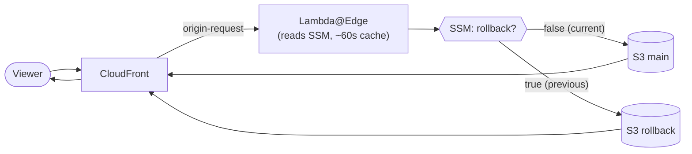

# CloudFront Blue/Green — Quickstart ⚡

> The lean version to understand and run the project in a few minutes.
> 🌐 **Languages:** **English** · [Português (Brasil)](../pt-br/quickstart.md)
> · ⬅️ [Main README](../../README.md) · 📖 [Complete guide](./full-guide.md)

---

## What it is

A **Terraform** stack for hosting static sites on **CloudFront + S3** with one superpower:
**instant rollback, with no new build required**.

When a release breaks in production, you don't re-deploy the old artifact or touch files by
hand — you just **run the rollback workflow (one click)** and the site is back to the
previous version in seconds.

## How it works (in 30 seconds)

- A **Lambda@Edge** function runs on CloudFront's `origin-request` event.
- On every request, it reads a parameter in **SSM Parameter Store** (`true`/`false`).
- `false` → serves the **main** bucket (current version). `true` → serves the **rollback**
  bucket (the previous version, kept warm and ready).
- A **deploy** always copies the current version into the rollback bucket before shipping
  the new one.
- A **rollback** is just flipping the toggle to `true` + invalidating the cache — **and the
  rollback workflow does exactly that with one click**, without you ever opening the AWS console.



> 🎨 **Diagram with AWS logos:** open [`architecture.drawio`](../architecture.drawio)
> in [draw.io](https://app.diagrams.net) or the *Draw.io Integration* VS Code extension.

## Provisioning modalities

Selected via `gha_gen_workflows.workflow_option`:

| Modality | What it provisions | Rollback | Restore by commit | Generated workflows |
|---|---|:---:|:---:|---|
| **`simple-deploy`** | CloudFront + 1 bucket | — | — | `deploy.yml` |
| **`deploy-and-rollback`** | + rollback bucket + Lambda@Edge + SSM | ✅ instant | — | `deploy.yml`, `rollback.yml` |
| **`deploy-rollback-and-restore`** | + versions bucket (`.tar.gz`) | ✅ instant | ✅ any version | `deploy.yml`, `rollback-and-restore.yml` |

## How to deploy

**Prerequisites:**
- **Terraform ≥ 1.5**
- **AWS CLI** (installed and configured) — [Installation guide](https://aws.amazon.com/cli/)
- An **AWS** account with permissions to create CloudFront, S3, Lambda, IAM, SSM, ACM, and Route 53 resources
- Deploy in **`us-east-1`** (required for CloudFront + Lambda@Edge)
- A **GitHub** repo for CI/CD

### AWS Authentication

Before provisioning, configure your AWS credentials via AWS CLI:

```bash
# Option 1: Interactive AWS CLI configuration
aws configure

# Or export credentials as environment variables:
export AWS_ACCESS_KEY_ID=your-access-key
export AWS_SECRET_ACCESS_KEY=your-secret-key
export AWS_DEFAULT_REGION=us-east-1

# Validate authentication
aws sts get-caller-identity
```

### Steps to provision

1. Create a `terraform.tfvars` (ready-made examples per modality in the
   [complete guide](./full-guide.md#configuration-examples-tfvars)).
2. Provision:
   ```bash
   terraform init
   terraform plan
   terraform apply
   ```
   This creates the AWS resources **and** writes the workflows into `.github/workflows`.
3. Commit the generated workflows to your GitHub repository.
4. Push to the deploy branch (default `main`) or run the **Deploy** workflow manually →
   the site ships via OIDC (no access keys).
5. Open the distribution URL (`cloudfront_urls` output) or your domain.

**To roll back:** run the **Rollback** workflow (one click). Done — previous version is live.

## Testing the full flow with the demo

The project ships a self-contained demo site under
[`bluegreen_site/`](../../bluegreen_site/) (a single HTML page, no framework). Suggested flow:

1. **Point the build at the demo** in your `tfvars`:
   ```hcl
   gha_gen_workflows = {
     # ...
     build_command    = "cd bluegreen_site && npm run build"
     build_output_dir = "bluegreen_site/dist"
   }
   ```
2. **Edit the content** in `bluegreen_site/src/index.html` (the `window.SITE_CONFIG` block —
   `headline` and `badge`). E.g. set the badge to `"v1 — first version"`.
3. **Deploy v1:** commit + push (or run the **Deploy** workflow). Open the site and confirm v1.
4. **Change something** (e.g. badge to `"v2 — second version"`) and **deploy v2**. Now v1 is
   preserved in the rollback bucket.
5. **Rollback:** run the **Rollback** workflow (one click). Refresh the page → you're back on
   **v1**, in seconds, with no rebuild.
6. *(Only in `deploy-rollback-and-restore`)* **Restore a specific version:** run
   **Rollback and Restore**, check *Restore a specific version*, and provide the **commit
   hash** of the version you want.

> 💡 Want to preview locally before shipping? `cd bluegreen_site && npm run build && npm run preview`
> (opens at `http://localhost:5050`).

---

📚 Want the details (variables, OAC vs website, OIDC, gotchas, full architecture)?
See the **[complete guide in English](./full-guide.md)** or in **[Portuguese](../pt-br/full-guide.md)**.
