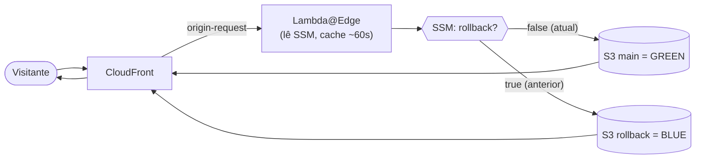

# CloudFront Blue/Green — Stack para Sites Estáticos com Rollback Instantâneo

> 🌐 **Idiomas:** **Português (Brasil)** · [English](../../README.md)

Uma stack Terraform para hospedar sites estáticos em **Amazon CloudFront + S3**, construída
em torno do padrão **blue/green**: quando uma versão dá problema, você volta para a anterior
**na hora — com um clique e sem precisar de um novo build**.

Em vez de re-deployar o artefato antigo ou restaurar arquivos na mão, você aciona uma única
"chave" (um valor no SSM Parameter Store) e uma função **Lambda@Edge** re-aponta o CloudFront,
de forma transparente, para a versão anterior, que ficou guardada e quente em um segundo
bucket S3. E, se quiser, dá para manter um arquivo de **todos** os builds e restaurar qualquer
versão antiga quando precisar.

A stack também provisiona — tudo opcional — registros no Route 53, certificados ACM para
domínios próprios, buckets públicos **ou** privados, e um pipeline completo de **CI/CD no
GitHub Actions** autenticado via **OIDC (sem access keys de longa duração)**.

---

## 📚 Mapa da documentação

Este README é o meio-termo: o suficiente para entender o projeto e começar. A partir daqui,
dois caminhos:

| Se você quer… | Vá para |
|---|---|
| **Só usar, rápido** | ⚡ Guia rápido — [Português](./quickstart.md) · [English](../en/quickstart.md) |
| **Entender cada detalhe** (variáveis, OAC vs website, OIDC, armadilhas) | 📖 Guia completo — [Português](./full-guide.md) · [English](../en/full-guide.md) |
| **Ver a arquitetura com os logos AWS** | 🎨 [`docs/architecture.drawio`](../architecture.drawio) (abra no [draw.io](https://app.diagrams.net) ou na extensão *Draw.io* do VS Code) |
| **Um site de demo para testar o fluxo todo** | 🧪 [`bluegreen_site/`](../../bluegreen_site/README.md) |

---

## Como funciona

O coração de tudo é uma **função Lambda@Edge no evento `origin-request` do CloudFront**. A cada
requisição que chega na origem, ela:

1. Lê um parâmetro no SSM (padrão `/Lambda/CF/Rollback`), com valor `"true"` ou `"false"`
   (cacheado na Lambda por uns 60s, para não bater no SSM a cada requisição).
2. Escolhe a origem: `"false"` → bucket **main** (versão atual); `"true"` → bucket de
   **rollback** (versão anterior); qualquer valor inesperado → cai de volta no main.
3. Reescreve a origem da requisição para esse bucket — uma **origem S3** (privado/OAC) ou uma
   **origem HTTP custom** (público/website).



No **deploy**, os buckets ficam em sincronia: o conteúdo atual do bucket main é copiado para o
bucket de rollback (preservando a versão anterior), aí roda o build, sobe a nova versão para o
main, garante que a chave esteja em `false` e invalida o cache.

O **rollback**, então, é um clique só: o workflow de rollback vira a chave para `"true"` e
invalida o cache — dentro do TTL de cache da Lambda (~60s), o CloudFront já serve a versão
anterior que estava guardada. Sem build, sem reupload.

> 🎨 Prefere a versão com os logos dos serviços AWS? Veja [`docs/architecture.drawio`](../architecture.drawio).

---

## Modalidades de deploy

Escolhidas em `gha_gen_workflows.workflow_option`. A escolha define tanto os recursos AWS que
você provisiona quanto os workflows do GitHub Actions que são gerados.

| Modalidade | O que provisiona | Rollback | Restore por commit | Workflows gerados |
|---|---|:---:|:---:|---|
| **`simple-deploy`** | CloudFront + 1 bucket | — | — | `deploy.yml` |
| **`deploy-and-rollback`** | + bucket rollback + Lambda@Edge + SSM | ✅ instantâneo | — | `deploy.yml`, `rollback.yml` |
| **`deploy-rollback-and-restore`** | + bucket de versões (`.tar.gz` por commit) | ✅ instantâneo | ✅ qualquer versão | `deploy.yml`, `rollback-and-restore.yml` |

A terceira modalidade guarda cada build como `<sha-do-commit>.tar.gz`, então você restaura
**qualquer** versão histórica pelo hash do commit — não só a imediatamente anterior. Os
detalhes e os exemplos de `tfvars` por modalidade estão no
[guia completo](./full-guide.md#as-três-modalidades-de-deploy).

---

## Principais recursos

- 🟦🟩 **Rollback blue/green instantâneo e de um clique** (Lambda@Edge + chave SSM, sem rebuild).
- 🗄️ **Arquivo e restauração de versões**, de qualquer build, pelo hash do commit (terceiro
  bucket opcional).
- 🔒 **Origens públicas ou privadas**: S3 website hosting **ou** OAC do CloudFront — a Lambda já
  vem do template certo automaticamente.
- 🌍 **Pronta para domínio próprio**: registros no Route 53 + certificado ACM (host único ou
  wildcard), opcionais.
- 🤖 **Workflows do GitHub Actions gerados automaticamente** conforme a modalidade escolhida.
- 🔑 **CI/CD sem chaves via OIDC**: uma relação de confiança GitHub↔AWS substitui as access
  keys, com uma policy de mínimo privilégio escopada exatamente aos seus buckets, parâmetro e
  distribuição.

---

## Como usar

O caminho rápido está no **[Guia rápido](./quickstart.md)**. Em resumo:

1. **Crie um `terraform.tfvars`** descrevendo seus buckets, o CloudFront, o modo da Lambda, o
   domínio e o repo do GitHub. (Exemplos prontos por modalidade:
   [guia completo → exemplos](./full-guide.md#exemplos-de-configuração-tfvars).)
2. **Provisione:**
   ```bash
   terraform init
   terraform plan
   terraform apply
   ```
   Isso cria os recursos na AWS **e** escreve os workflows em `.github/workflows`.
3. **Commite os workflows gerados** no seu repositório.
4. **Dispare um deploy** — faça push na branch de deploy (padrão `main`) ou rode o workflow
   **Deploy** na mão. Ele assume a role IAM via OIDC, faz build, sobe para o S3 e invalida.
5. **Faça rollback quando precisar**, rodando o workflow **Rollback** (um clique).

> 🧪 Quer validar de ponta a ponta antes? A demo em [`bluegreen_site/`](../../bluegreen_site/README.md)
> é uma única página HTML autocontida; o
> [Guia rápido](./quickstart.md#testando-o-fluxo-completo-com-a-demo) mostra um ciclo completo
> de deploy → deploy → rollback → restore com ela.

### Pré-requisitos

- **Terraform ≥ 1.5**, **AWS provider ~> 6.33**.
- Uma **conta AWS**, com a stack em **`us-east-1`** (exigência do certificado ACM do CloudFront
  e do Lambda@Edge).
- Um **repositório GitHub** para o CI/CD gerado; uma **hosted zone no Route 53** para domínios
  próprios.

---

## Estrutura do repositório

```text
.
├── README.md               # raiz, em inglês — a doc principal (meio-termo)
├── *.tf                     # stack raiz: S3, CloudFront, Lambda@Edge, ACM, Route 53, outputs
├── lambda/                  # templates da Lambda@Edge: oac/ (privado) e s3_website/ (público)
├── modules/gha_gen_workflows/  # gerador de OIDC + IAM + workflows do GitHub Actions
├── bluegreen_site/          # site estático de demonstração, autocontido
└── docs/
    ├── architecture.drawio  # diagrama da arquitetura com os logos AWS (draw.io)
    ├── en/  {quickstart.md, full-guide.md}
    └── pt-br/  {README.md, quickstart.md, full-guide.md}
```

O detalhamento arquivo a arquivo está no
[guia completo → estrutura do repositório](./full-guide.md#estrutura-do-repositório).

---

## Bom saber

Algumas restrições que vale ter em mente (o
[guia completo](./full-guide.md#convenções-restrições-e-armadilhas) explica cada uma):

- **Faça o deploy em `us-east-1`** (exigência do ACM do CloudFront + Lambda@Edge).
- **Exatamente um bucket de produção** (`main_bucket = true`, `versions_bucket = false`) — o
  nome pode ser qualquer um; uma validação garante isso.
- Cada bucket é **ou** público (`website = true`) **ou** privado (`origin_access_control = true`),
  nunca os dois, e o `lambda_edge.cf_access_bucket_mode` precisa combinar.
- Para **domínio próprio**, use ACM (`acm.create = true`) e deixe o certificado padrão do
  CloudFront em `false`.
- A propagação do rollback ≈ TTL de cache da Lambda (~60s) + tempo de invalidação — é rápido,
  mas não literalmente instantâneo.

---

## Casos de uso

- **Sites de marketing, landing pages e docs** que não podem ficar "presos quebrados".
- **SPAs** (React/Vue/Angular) que querem deployar com frequência e segurança, com uma rota de
  fuga rápida.
- **Times migrando para CI/CD sem chaves** (OIDC), em vez de gerenciar access keys.
- **Ambientes auditados**, que se beneficiam de um arquivo imutável de cada build e de
  restaurações exatas por commit.

---

> 📖 Aprofunde no guia completo ([PT](./full-guide.md) · [EN](../en/full-guide.md)) · ⚡ ou
> comece pelo guia rápido ([PT](./quickstart.md) · [EN](../en/quickstart.md)).
