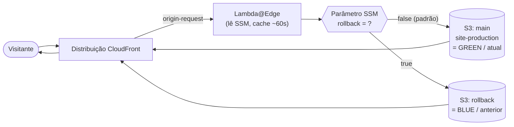
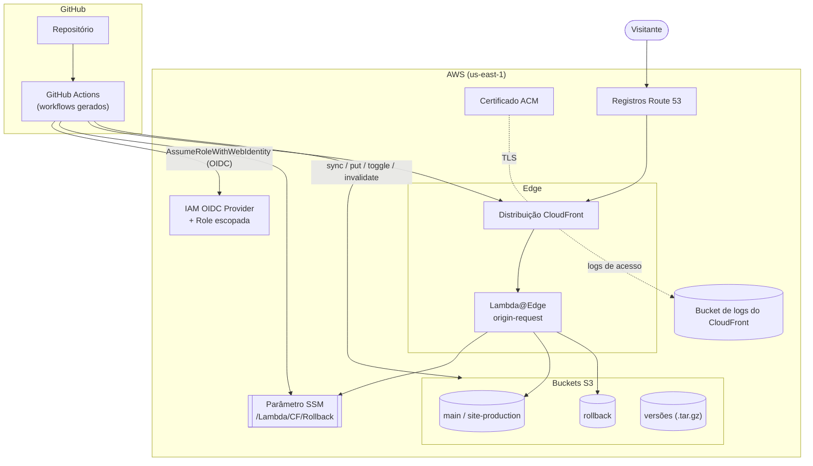

# CloudFront Blue/Green — Stack para Sites Estáticos com Rollback Instantâneo

> 📖 **Guia completo** · 🌐 **Idiomas:** **Português (Brasil)** · [English](../en/full-guide.md)
> · ⬅️ Voltar ao [README principal](./README.md) · ⚡ Com pressa? [Guia rápido](./quickstart.md)

Esta é uma stack Terraform para hospedar sites estáticos em **Amazon CloudFront + S3** — só
que com uma ideia central: tornar o **rollback de uma versão instantâneo, sem precisar de um
novo build**.

A diferença em relação a um setup tradicional é o padrão **blue/green**. Quando algo quebra
em produção, você não precisa re-deployar o artefato antigo nem restaurar arquivos na mão.
Basta acionar uma "chave" (um valor no SSM Parameter Store) e uma função **Lambda@Edge**
re-aponta o CloudFront, de forma transparente, para a versão *anterior*, que ficou guardada
e pronta em um segundo bucket S3. E se você quiser ir além, dá para manter um arquivo de
**todos** os builds (cada um empacotado pelo hash do commit) e restaurar qualquer versão
antiga sob demanda.

Tudo o que está em volta disso também vem incluído e é opcional: registros DNS no Route 53,
certificados ACM para domínios customizados, buckets públicos (via S3 website) **ou**
privados (via OAC) e um pipeline completo de **CI/CD no GitHub Actions** que autentica via
**OIDC — ou seja, sem precisar de access keys de longa duração** espalhadas por aí.

---

## Índice

1. [Por que este projeto existe](#por-que-este-projeto-existe)
2. [Principais recursos](#principais-recursos)
3. [Como o blue/green funciona aqui](#como-o-bluegreen-funciona-aqui)
4. [As três modalidades de deploy](#as-três-modalidades-de-deploy)
5. [Arquitetura](#arquitetura)
6. [Modos de acesso ao bucket: público (website) vs privado (OAC)](#modos-de-acesso-ao-bucket-público-website-vs-privado-oac)
7. [GitHub Actions + OIDC (CI/CD sem chaves)](#github-actions--oidc-cicd-sem-chaves)
8. [Estrutura do repositório](#estrutura-do-repositório)
9. [Pré-requisitos](#pré-requisitos)
10. [Primeiros passos](#primeiros-passos)
11. [Exemplos de configuração (`tfvars`)](#exemplos-de-configuração-tfvars)
12. [Operação do dia a dia: deploy, rollback, restore](#operação-do-dia-a-dia-deploy-rollback-restore)
13. [Referência de variáveis](#referência-de-variáveis)
14. [Outputs](#outputs)
15. [Convenções, restrições e armadilhas](#convenções-restrições-e-armadilhas)
16. [Casos de uso](#casos-de-uso)
17. [Sugestões de melhoria / roadmap](#sugestões-de-melhoria--roadmap)

---

## Por que este projeto existe

Servir um site estático com CloudFront + S3 é simples e funciona muito bem. O problema
aparece na hora de voltar atrás: quando uma versão ruim vai para produção, as saídas
habituais costumam ser todas ruins. Você pode re-rodar o build anterior e subir tudo de
novo — o que é lento e ainda assume que aquele build continua reproduzível. Pode tentar
restaurar versões de objetos no S3 manualmente — trabalhoso e fácil de errar. Ou pode
simplesmente conviver com o site fora do ar enquanto resolve o problema.

A proposta aqui é diferente: **o rollback é uma operação de primeira classe e quase
imediata**. Na prática, isso significa três coisas:

- A **versão que estava no ar fica sempre guardada e quente** em um bucket dedicado.
- Trocar entre "atual" e "anterior" é só **virar uma chave** — sem build, sem reupload do
  alvo do rollback.
- A propagação é limitada pelo TTL curto de cache da Lambda (~60s) somado a uma invalidação
  do CloudFront, então a recuperação acontece em **segundos**.

E como ninguém quer montar isso tudo do zero, a stack já entrega o ferramental operacional
junto — os workflows de CI/CD e o IAM de mínimo privilégio. Um time consegue adotar o padrão
inteiro só preenchendo um punhado de variáveis no Terraform.

---

## Principais recursos

- 🟦🟩 **Rollback blue/green instantâneo**, comandado por uma Lambda@Edge no evento
  `origin-request` + uma chave no SSM Parameter Store — **e sem rebuild nenhum**.
- 🗄️ **Arquivo e restauração de versões** (com um terceiro bucket opcional): cada build vira
  um `hash-do-commit.tar.gz`, então você restaura **qualquer** versão antiga, não só a
  imediatamente anterior.
- 🔁 **Três modalidades de provisionamento** que vão ganhando recursos aos poucos
  (simples → rollback → rollback + restore). Cada uma cria exatamente os recursos e workflows
  de que precisa, nada além.
- 🔒 **Origens públicas ou privadas**: sirva os buckets de forma pública via S3 website
  hosting, ou de forma privada via **Origin Access Control (OAC)** do CloudFront. A Lambda
  já é renderizada com o template certo para o modo escolhido.
- 🌍 **Pronta para domínio próprio**: registros no Route 53 + certificado ACM (host único ou
  wildcard), opcionais e já conectados à distribuição.
- 🤖 **Workflows do GitHub Actions gerados automaticamente** conforme a modalidade escolhida
  (deploy / rollback / restore) e escritos direto no `.github/workflows` do seu repositório.
- 🔑 **CI/CD sem chaves via OIDC**: a relação de confiança entre GitHub e AWS (provider OIDC
  + IAM role) substitui as access keys estáticas, e a policy é **escopada exatamente** aos
  buckets, ao parâmetro e à distribuição que entram na jogada.
- 🧱 **CloudFront bem parametrizável**: cache behaviors, ordered behaviors, respostas de erro
  customizadas, restrições geográficas, logging, versão HTTP e por aí vai.

---

## Como o blue/green funciona aqui

O coração de tudo é uma **função Lambda@Edge associada ao evento `origin-request` do
CloudFront**. A cada requisição que chega na origem, ela faz três coisas:

1. Lê um parâmetro no SSM (nome padrão `/Lambda/CF/Rollback`), cujo valor é `"true"` ou
   `"false"`. Para não bater no SSM a cada requisição, esse valor fica **cacheado na Lambda
   por uns 60 segundos** (`CACHE_TTL_MS`).
2. Decide a origem com base nesse valor:
   - `"false"` → bucket **main / produção** (o *green*, a versão atual).
   - `"true"` → bucket de **rollback** (o *blue*, a versão anterior).
   - qualquer valor inesperado → cai de volta no bucket main, por segurança.
3. Reescreve o `request.origin` (e o header `Host`) para apontar o CloudFront ao bucket
   escolhido — usando uma **origem S3** (modo OAC) ou uma **origem HTTP custom** (modo website).



No caminho feliz, o **deploy** mantém os dois buckets em sincronia mais ou menos assim:

1. Copia o conteúdo **atual** do bucket main para o bucket de **rollback** — é essa cópia que
   vira a "versão anterior" para onde você pode voltar.
2. Faz o build e sobe a **nova** versão para o bucket **main**.
3. Garante que a chave de rollback esteja em `"false"` (servindo a nova versão).
4. Invalida o cache do CloudFront.

Com isso pronto, o **rollback fica a um único clique de distância**: você não precisa mexer
no Parameter Store na mão nem abrir o console da AWS. Basta disparar o workflow de rollback
no GitHub Actions e ele mesmo cuida de trocar o valor da chave de `"false"` para `"true"` e
invalidar o cache. Em questão de segundos (dentro do TTL de cache da Lambda), o CloudFront já
está servindo a versão anterior que estava guardada no bucket de rollback — **tudo isso sem
build e sem reupload**.

> O recurso Terraform `aws_ssm_parameter.rollback` usa `ignore_changes = [value]`. Ou seja:
> virar a chave pelo workflow (ou manualmente) nunca vai aparecer como drift no Terraform.

---

## As três modalidades de deploy

A modalidade é escolhida em `gha_gen_workflows.workflow_option` e define duas coisas: quais
**recursos AWS** você deve provisionar e quais **workflows do GitHub Actions** são gerados.

| Capacidade | `simple-deploy` | `deploy-and-rollback` | `deploy-rollback-and-restore` |
|---|:---:|:---:|:---:|
| Bucket main (produção) | ✅ | ✅ | ✅ |
| Bucket de rollback | — | ✅ | ✅ |
| Bucket de arquivo de versões | — | — | ✅ |
| Lambda@Edge + chave SSM | — | ✅ | ✅ |
| Rollback instantâneo para versão anterior | — | ✅ | ✅ |
| Restaurar **qualquer** versão histórica (por hash de commit) | — | — | ✅ |
| Workflows gerados | `deploy.yml` | `deploy.yml`, `rollback.yml` | `deploy.yml`, `rollback-and-restore.yml` |

### 1. `simple-deploy`
O bom e velho CloudFront + S3 com um único bucket. Um workflow faz build, sobe para o S3 e
invalida o cache. Sem Lambda, sem mecânica de rollback. É uma boa linha de base, ideal para
sites que não precisam de rollback rápido.

### 2. `deploy-and-rollback`
Aqui entram o bucket de **rollback**, a função **Lambda@Edge** e a **chave no SSM**. O
workflow de deploy preserva a versão anterior antes de subir a nova, e um `rollback.yml`
separado vira a chave para servir a versão anterior na hora.

### 3. `deploy-rollback-and-restore`
Tudo o que vem acima **mais** um bucket de **versões**. Agora cada deploy também empacota o
build como `<sha-do-commit>.tar.gz` e guarda no bucket de versões. O workflow
`rollback-and-restore.yml` te dá dois caminhos:

- **alternar o rollback** (servir a versão imediatamente anterior), ou
- **restaurar uma versão específica** informando o hash do commit — o workflow baixa aquele
  arquivo, repopula o bucket main, devolve a chave para `false` e invalida o cache.

---

## Arquitetura



**Sobre o provider e a região.** Esta stack foi desenhada para rodar em **`us-east-1`**, e
isso não é à toa: o certificado ACM do CloudFront e as funções Lambda@Edge precisam viver
nessa região, e a Lambda lê o SSM de `us-east-1`. Faça o deploy de tudo lá. Os detalhes estão
em [Convenções, restrições e armadilhas](#convenções-restrições-e-armadilhas).

---

## Modos de acesso ao bucket: público (website) vs privado (OAC)

Cada bucket declara **como o CloudFront vai alcançá-lo**, e o resto da stack se ajusta a essa
escolha:

| Modo | Flag no bucket | Origem CloudFront | Template da Lambda | Acesso público |
|---|---|---|---|---|
| **OAC** (recomendado, privado) | `origin_access_control = true` | Origem S3 + Origin Access Control | `lambda/oac/index.js.tpl` | Bucket fechado para o público; só o CloudFront lê (SigV4 + condição `AWS:SourceArn`). |
| **Website** (público) | `website = true` | Origem HTTP custom para o endpoint de website do S3 | `lambda/s3_website/index.js.tpl` | Bucket com policy pública `s3:GetObject` + website hosting. |

Cada bucket precisa ficar com **exatamente um** dos dois modos — tem uma validação que recusa
`website` e `origin_access_control` com o mesmo valor. O template da Lambda vem de
`lambda_edge.cf_access_bucket_mode` (`"oac"` ou `"s3_website"`), e preconditions do Terraform
garantem que o modo da Lambda bata com o modo de acesso dos buckets.

- No **modo OAC**, a origem é reescrita para uma **origem S3** (`request.origin.s3`).
- No **modo Website**, ela vira uma **origem HTTP custom** (`request.origin.custom`, porta 80,
  `http-only`) apontando para o endpoint de website do S3.

---

## GitHub Actions + OIDC (CI/CD sem chaves)

O módulo `gha_gen_workflows` monta toda a camada de CI/CD **sem nenhuma credencial estática**:

- Um **provider OIDC** para `token.actions.githubusercontent.com`. O thumbprint SHA-1 é
  buscado dinamicamente do certificado vivo do GitHub (via provider `tls`), então ele nunca
  fica desatualizado.
- Uma **IAM role** com uma **trust policy restrita ao seu repositório** (`repo:<org>/<repo>:*`
  — só branches/tags/PRs daquele repo), que pode ser assumida via
  `sts:AssumeRoleWithWebIdentity`.
- Uma **policy de mínimo privilégio**, escopada exatamente a:
  - os **buckets ativos** da modalidade escolhida (`s3:ListBucket`, `GetObject`, `PutObject`,
    `DeleteObject`),
  - o **parâmetro SSM específico** (`PutParameter`/`GetParameter…`),
  - a **distribuição CloudFront específica** (`CreateInvalidation`/`GetInvalidation`/
    `ListInvalidations`).
- Os **arquivos de workflow escritos no seu repositório** em `workflows_output_path`
  (padrão `.github/workflows`), renderizados a partir dos templates da modalidade escolhida.

Todo workflow gerado se autentica com `aws-actions/configure-aws-credentials@v4`, usando
`role-to-assume: <ARN da role gerada>` e `permissions: id-token: write`.

---

## Estrutura do repositório

```text
.
├── main.tf                 # Terraform + providers AWS/random, default tags
├── variables.tf            # Variáveis de entrada raiz (+ validações & preconditions)
├── locals.tf               # Classificação dos buckets (main/rollback/versions, oac/website)
├── data.tf                 # aws_caller_identity
├── s3.tf                   # Buckets, policies, public-access blocks, bucket de logs
├── cloudfront.tf           # OAC + distribuição CloudFront (origens, behaviors, assoc. da Lambda)
├── lambda_edge.tf          # Empacotamento da Lambda@Edge, role/policy IAM, parâmetro SSM
├── acm.tf                  # Certificado ACM + registros de validação DNS
├── route53.tf              # Registros alias A do Route 53 para a distribuição
├── outputs.tf              # cloudfront_urls
├── gha_workflows.tf        # Conecta o módulo gha_gen_workflows
│
├── lambda/
│   ├── oac/index.js.tpl        # Template da Lambda para origens privadas (OAC)
│   └── s3_website/index.js.tpl # Template da Lambda para origens públicas (website)
│
├── modules/
│   └── gha_gen_workflows/
│       ├── variables.tf        # Entradas do módulo
│       ├── oidc.tf             # Provider OIDC do GitHub
│       ├── iam_role.tf         # Trust escopada ao repo + role
│       ├── iam_policy.tf       # Policy de deploy de mínimo privilégio
│       ├── templates.tf        # Renderiza workflows conforme workflow_option
│       ├── validations.tf      # Checagens cruzadas (buckets obrigatórios)
│       ├── outputs.tf          # ARNs de role/provider/policy + caminhos dos arquivos gerados
│       ├── versions.tf         # Restrições de provider/versão
│       └── templates/          # Templates de workflow (.yml.tpl)
│           ├── simple-deploy.yml.tpl
│           ├── deploy-with-rollback-backup.yml.tpl
│           ├── rollback-toggle.yml.tpl
│           ├── deploy-with-versioning.yml.tpl
│           └── rollback-and-restore.yml.tpl
│
└── bluegreen_site/         # Site estático de demonstração para testar o pipeline
    ├── package.json
    ├── README.md
    └── src/index.html
```

---

## Pré-requisitos

- **Terraform** `>= 1.5.0` (o módulo de workflows usa blocos `check`).
- **AWS provider** `~> 6.33` na raiz; o módulo é compatível com `>= 5.0`.
- Uma **conta AWS** com permissão para criar recursos de CloudFront, S3, Lambda, IAM, SSM,
  ACM e Route 53.
- **`us-east-1`** como região de deploy (exigência do ACM do CloudFront + Lambda@Edge).
- Um **repositório GitHub** (org + nome do repo) caso queira o CI/CD gerado.
- Para domínios customizados: uma **hosted zone no Route 53** para o seu domínio.

---

## Primeiros passos

1. **Crie um `terraform.tfvars`** (veja os [exemplos abaixo](#exemplos-de-configuração-tfvars))
   descrevendo seus buckets, as configurações do CloudFront, o modo da Lambda, o domínio e o
   repo do GitHub.

2. **Inicialize e revise:**
   ```bash
   terraform init
   terraform plan
   ```

3. **Aplique:**
   ```bash
   terraform apply
   ```
   Isso provisiona os recursos na AWS **e** escreve os arquivos de workflow do GitHub Actions
   em `workflows_output_path` (padrão `.github/workflows`).

4. **Commite os workflows gerados** no seu repositório GitHub.

5. **Dispare o deploy** — faça push na branch de deploy (padrão `main`) ou rode o workflow
   `Deploy` na mão (`workflow_dispatch`). Ele assume a role IAM via OIDC, faz o build, sobe
   para o S3 e invalida o CloudFront.

6. **Acesse seu site** no domínio da distribuição (veja o output `cloudfront_urls`) ou no seu
   domínio customizado.

> 💡 Quer um site pronto só para testar o pipeline de ponta a ponta? Use a demo em
> [`bluegreen_site/`](../../bluegreen_site/README.md) — uma única página HTML autocontida, com um
> `npm run build` trivial que só copia `src/` para `dist/`.

---

## Exemplos de configuração (`tfvars`)

### A) Origens privadas (OAC) + domínio customizado + rollback & restore completos

```hcl
region = "us-east-1"

buckets = [
  {
    name                  = "site-production" # bucket main — qualquer nome funciona (veja armadilhas)
    main_bucket           = true
    origin_access_control = true
    website               = false
    force_destroy         = true
  },
  {
    name                  = "site-rollback"
    main_bucket           = false
    origin_access_control = true
    website               = false
    force_destroy         = true
  },
  {
    name                  = "site-versions"
    main_bucket           = false
    versions_bucket       = true
    origin_access_control = true
    website               = false
    versioning            = true
    force_destroy         = true
  },
]

lambda_edge = {
  enabled               = true
  cf_access_bucket_mode = "oac"
}

cloudfront = {
  enabled             = true
  default_root_object = "index.html"
  aliases             = ["app.example.com"]

  viewer_certificate = {
    cloudfront_default_certificate = false # usando certificado ACM customizado
    ssl_support_method             = "sni-only"
  }

  default_cache_behavior = {
    allowed_methods        = ["GET", "HEAD"]
    cached_methods         = ["GET", "HEAD"]
    viewer_protocol_policy = "redirect-to-https"
    min_ttl                = 0
    default_ttl            = 3600
    max_ttl                = 86400
    forwarded_values = {
      query_string = false
      cookies      = { forward = "none" }
    }
  }

  restrictions          = { geo_restriction = { restriction_type = "none" } }
  custom_error_response = [
    { error_code = 403, response_page_path = "/index.html", response_code = 200, error_caching_min_ttl = 0 },
    { error_code = 404, response_page_path = "/index.html", response_code = 200, error_caching_min_ttl = 0 },
  ]
}

acm = {
  create            = true
  wildcard          = false
  validation_method = "DNS"
}

route53 = {
  enabled = true
  domain  = "example.com"
}

gha_gen_workflows = {
  github_org       = "minha-org"
  github_repo      = "meu-repo"
  workflow_option  = "deploy-rollback-and-restore"
  build_command    = "npm ci && npm run build"
  build_output_dir = "./dist"
  deploy_branch    = "main"
}
```

### B) Origens públicas (S3 website) + certificado padrão do CloudFront + rollback simples

As diferenças principais: os buckets usam `website = true` / `origin_access_control = false`,
o modo da Lambda é `s3_website`, usa-se o certificado padrão do CloudFront (sem ACM/Route 53)
e a modalidade é `deploy-and-rollback` (sem bucket de versões).

```hcl
region = "us-east-1"

buckets = [
  { 
    name = "site-production", 
    main_bucket = true,   
    website = true, 
    origin_access_control = false, 
    force_destroy = true 
  },
  { 
    name = "site-rollback", 
    main_bucket = false, 
    website = true, 
    origin_access_control = false, 
    force_destroy = true 
  },
]

lambda_edge = {
  enabled               = true
  cf_access_bucket_mode = "s3_website"
}

cloudfront = {
  enabled             = true
  default_root_object = "index.html"

  viewer_certificate = {
    cloudfront_default_certificate = true
  }

  default_cache_behavior = {
    allowed_methods        = ["GET", "HEAD"]
    cached_methods         = ["GET", "HEAD"]
    viewer_protocol_policy = "redirect-to-https"
    min_ttl                = 0
    default_ttl            = 3600
    max_ttl                = 86400
    forwarded_values = {
      query_string = false
      cookies      = { forward = "none" }
    }
  }

  restrictions          = { geo_restriction = { restriction_type = "none" } }
  custom_error_response = []
}

acm     = { create = false }
route53 = { enabled = false }

gha_gen_workflows = {
  github_org       = "minha-org"
  github_repo      = "meu-repo"
  workflow_option  = "deploy-and-rollback"
  build_command    = "npm ci && npm run build"
  build_output_dir = "./dist"
}
```

> Para um site **`simple-deploy`** você só precisa do único bucket `site-production` e pode
> deixar `lambda_edge.enabled = false`; é só definir
> `gha_gen_workflows.workflow_option = "simple-deploy"`.

---

## Operação do dia a dia: deploy, rollback, restore

### Deploy
Faça push na branch de deploy (ou rode **Deploy** via `workflow_dispatch`). O workflow copia
o conteúdo atual do bucket main para o bucket de rollback, faz o build, sobe o novo build para
o bucket main, garante que a chave esteja em `false` e invalida o CloudFront. (Na modalidade
`deploy-rollback-and-restore`, ele ainda arquiva o `<commit>.tar.gz` no bucket de versões.)

### Rollback para a versão anterior (instantâneo, sem build)
É literalmente um clique: rode o workflow **Rollback** (`deploy-and-rollback`) ou o
**Rollback and Restore** com a opção *Restaurar uma versão específica* **desmarcada**
(`deploy-rollback-and-restore`). O próprio workflow seta a chave SSM para `"true"` e invalida
o cache — você não precisa abrir o console nem mexer no Parameter Store manualmente. Dentro do
TTL de cache da Lambda (~60s), o CloudFront já volta a servir a versão anterior que estava
guardada no bucket de rollback.

### Restaurar uma versão histórica específica (só na `deploy-rollback-and-restore`)
Rode o **Rollback and Restore**, marque *Restaurar uma versão específica* e informe o **hash
do commit**. O workflow confere se aquele arquivo existe, baixa o `<commit>.tar.gz` do bucket
de versões, esvazia e repopula o bucket main com aquela versão, devolve a chave para `"false"`
e invalida o cache.

> Para sair de um rollback e voltar para o "atual", é só rodar um deploy normal — ele já
> recoloca a chave em `false`.

---

## Referência de variáveis

### Módulo raiz

| Variável | Tipo / campos-chave | Padrão | Descrição |
|---|---|---|---|
| `region` | `string` | — | Região AWS. Use `us-east-1` (veja armadilhas). |
| `buckets` | `list(object)` | — | Buckets a criar. Por bucket: `name`, `main_bucket` (obrigatórios); `versions_bucket`, `website`, `origin_access_control`, `versioning`, `force_destroy`, `index_document`, `error_document` (opcionais). Validação: `website` e `origin_access_control` devem ser diferentes. |
| `cloudfront` | `object` | — | Configuração completa do CloudFront: `enabled`, `default_root_object`, `aliases`, `default_cache_behavior`, `ordered_cache_behaviors`, `custom_error_response`, `restrictions`, `viewer_certificate`, `logging_config`, `price_class`, `http_version`, `web_acl_id`, etc. |
| `lambda_edge` | `object` | `enabled=false` | Lambda do blue/green: `enabled`, `cf_access_bucket_mode` (`"oac"`/`"s3_website"`), `function_name`, `parameter_store_name` (padrão `/Lambda/CF/Rollback`), `handler`, `runtime` (padrão `nodejs20.x`), `associations` (padrão `origin-request`). |
| `route53` | `object` | `enabled=false` | `enabled`, `domain`, `private_zone`. Quando habilitado, `domain` é obrigatório. |
| `acm` | `object` | `create=true` | `create`, `wildcard`, `validation_method`. Deve ser o inverso de `cloudfront.viewer_certificate.cloudfront_default_certificate`. |
| `gha_gen_workflows` | `object` | veja abaixo | `github_org`, `github_repo` (obrigatórios); `generate_workflows`, `role_name`, `workflow_option`, `workflows_output_path`, `deploy_branch`, `build_command`, `build_output_dir`. |

**Campos por bucket (`buckets[*]`):**

| Campo | Padrão | Significado |
|---|---|---|
| `name` | — | Nome base do bucket (um sufixo aleatório de 2 bytes é adicionado para garantir unicidade). |
| `main_bucket` | — | `true` para o bucket de produção/atual. |
| `versions_bucket` | `false` | `true` para o bucket de arquivo de builds. |
| `website` | `false` | Origem pública via S3 website hosting. |
| `origin_access_control` | `true` | Origem privada via OAC do CloudFront. |
| `versioning` | `false` | Habilita versionamento de objetos S3. |
| `force_destroy` | `false` | Permite ao Terraform deletar um bucket não vazio. |
| `index_document` / `error_document` | `index.html` / `error.html` | Documentos do website (modo website). |

### Módulo `gha_gen_workflows`

| Variável | Padrão | Descrição |
|---|---|---|
| `github_org` / `github_repo` | — | Repositório ao qual a confiança OIDC é escopada. |
| `role_name` | `github-actions-deploy-role` | Nome da IAM role assumida pelo Actions. |
| `workflow_option` | `simple-deploy` | `simple-deploy` / `deploy-and-rollback` / `deploy-rollback-and-restore`. |
| `workflows_output_path` | `.github/workflows` | Onde escrever os arquivos `.yml` gerados. |
| `deploy_branch` | `main` | Branch que dispara o `deploy.yml`. |
| `build_command` | `npm ci && npm run build` | Comando de build injetado nos workflows. |
| `build_output_dir` | `./build` | Diretório sincronizado com o S3 (ex.: `./dist`). |
| `generate_workflows` | `true` | Liga/desliga a geração de arquivos. |
| `s3_main_bucket_name` / `s3_rollback_bucket_name` / `s3_versions_bucket_name` | conectado da raiz | Buckets referenciados pela policy & workflows. |
| `ssm_parameter_name` / `ssm_parameter_arn` | conectado da raiz | Parâmetro da chave de rollback. |
| `cloudfront_distribution_id` / `cloudfront_distribution_arn` | conectado da raiz | Para permissões & comandos de invalidação. |

---

## Outputs

### Raiz
| Output | Descrição |
|---|---|
| `cloudfront_urls` | O domínio da distribuição mais quaisquer aliases configurados. |

### Módulo `gha_gen_workflows`
| Output | Descrição |
|---|---|
| `github_actions_role_arn` | ARN da role para usar como `role-to-assume`. |
| `github_actions_oidc_provider_arn` | ARN do provider OIDC criado. |
| `github_actions_policy_arn` | ARN da policy de deploy. |
| `generated_workflow_files` | Caminhos dos arquivos de workflow escritos para a modalidade escolhida. |

---

## Convenções, restrições e armadilhas

- **A região precisa ser `us-east-1`.** O certificado ACM do CloudFront e as funções
  Lambda@Edge precisam ser criados em `us-east-1`, e a Lambda lê o SSM dessa mesma região.
  Faça o deploy de toda a stack lá.
- **Exatamente um bucket de produção.** Você precisa declarar exatamente um bucket com
  `main_bucket = true` e `versions_bucket = false` (garantido por uma validação na variável).
  Quando você deixa `cloudfront.default_cache_behavior.target_origin_id` (e o dos ordered
  behaviors) em `null`, a distribuição deriva a origem padrão automaticamente desse bucket —
  e ele pode ter qualquer nome. Você ainda pode definir o `target_origin_id` explicitamente
  para sobrescrever.
- **`website` XOR `origin_access_control`.** Cada bucket precisa escolher um modo de acesso;
  a validação recusa valores iguais, e as preconditions garantem que
  `lambda_edge.cf_access_bucket_mode` combine (website → `s3_website`, OAC → `oac`).
- **ACM e certificado padrão são mutuamente exclusivos.** `acm.create` tem que ser o inverso
  de `cloudfront.viewer_certificate.cloudfront_default_certificate`. Para domínio customizado,
  deixe o certificado padrão em `false` e `acm.create = true`.
- **O Terraform ignora o valor do parâmetro SSM** (`ignore_changes = [value]`), justamente para
  que as trocas feitas pelo CI/CD não virem drift. O Terraform sempre o (re)cria com `"false"`.
- **A latência de propagação do rollback** ≈ TTL de cache da Lambda (~60s) + tempo de
  invalidação do CloudFront. É rápido, mas não é literalmente instantâneo ao milissegundo.
- **Os nomes dos buckets ganham um sufixo aleatório** (`<nome>-<hex>`); pegue os nomes reais
  pelos outputs/state, não tente adivinhar.
- **`force_destroy`** é o que permite ao Terraform destruir buckets não vazios — ótimo para
  demos, mais arriscado em produção.

---

## Casos de uso

- **Sites de marketing, landing pages e docs** que não podem ficar "presos quebrados" — uma
  versão ruim está a um toggle de distância da recuperação.
- **SPAs (React/Vue/Angular)** em CloudFront + S3 que querem deployar com frequência e
  segurança, sabendo que têm uma rota de fuga rápida garantida.
- **Times migrando para CI/CD sem chaves**, que preferem autenticação GitHub→AWS via OIDC já
  pronta a ficar gerenciando access keys.
- **Ambientes regulados ou auditados**, que se beneficiam de um arquivo imutável de cada build
  (o bucket de versões) e da possibilidade de restaurar uma versão histórica exata por commit.
- **Demonstrações e treinamentos** sobre como o deploy blue/green funciona na borda do CDN.

---

## Sugestões de melhoria / roadmap

Algumas ideias para o projeto ir mais longe (ainda não implementadas):

- **Rollout em etapas / canary**: estender a Lambda para mandar uma fatia do tráfego para a
  nova versão antes do corte total.
- **Política de lifecycle no bucket de versões** para expirar arquivos antigos (controle de
  custo), além de um workflow para listar as versões disponíveis.
- **Auto-rollback guiado por health-check**: um alarme do CloudWatch + automação que vira a
  chave sozinho quando os 5xx/taxa de erro disparam.
- **Notificações no Slack/Teams** a partir dos workflows, em eventos de deploy/rollback/restore.
- **Empacotamento no Terraform Registry** + um diretório `examples/` com `tfvars` prontos por
  modalidade e um check de CI (`terraform validate`/`fmt`/`tflint`).
- **Orientação sobre backend de state remoto** (S3 + lock no DynamoDB) e um layout
  multi-ambiente (dev/stage/prod).
- **Migrar a Lambda@Edge para CloudFront Functions / KeyValueStore** onde der, buscando menos
  latência e custo na leitura da chave.

---

> 📄 Este documento também está disponível em [inglês](../en/full-guide.md) ·
> ⬅️ [README principal](./README.md) · ⚡ [Guia rápido](./quickstart.md)
