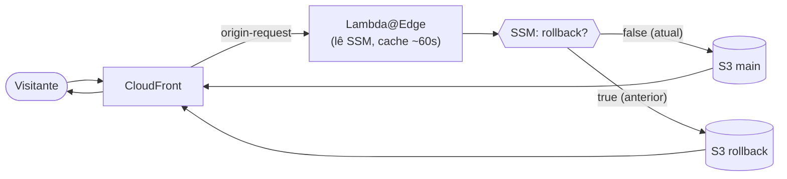

# CloudFront Blue/Green — Guia Rápido ⚡

> Versão enxuta para entender e rodar o projeto em poucos minutos.
> 🌐 **Idiomas:** **Português (Brasil)** · [English](../en/quickstart.md)
> · ⬅️ [README principal](./README.md) · 📖 [Guia completo](./full-guide.md)

---

## O que é

Uma stack **Terraform** para hospedar sites estáticos em **CloudFront + S3** com uma
superpotência: **rollback instantâneo, sem precisar de um novo build**.

Quando uma versão quebra em produção, você não re-deploya o artefato antigo nem mexe em
arquivo na mão — apenas **roda o workflow de rollback (um clique)** e o site volta para a
versão anterior em segundos.

## Como funciona (em 30 segundos)

- Uma função **Lambda@Edge** roda no evento `origin-request` do CloudFront.
- A cada requisição, ela lê um parâmetro no **SSM Parameter Store** (`true`/`false`).
- `false` → serve o bucket **main** (versão atual). `true` → serve o bucket **rollback**
  (versão anterior, que ficou guardada e quente).
- O **deploy** sempre copia a versão atual para o bucket de rollback antes de subir a nova.
- O **rollback** é só virar a chave para `true` + invalidar o cache — **e isso o workflow
  de rollback faz com um clique**, sem você abrir o console da AWS.



> 🎨 **Diagrama com os logos AWS:** abra [`architecture.drawio`](../architecture.drawio)
> no [draw.io](https://app.diagrams.net) ou na extensão *Draw.io Integration* do VS Code.

## Modalidades de provisionamento

Escolhidas em `gha_gen_workflows.workflow_option`:

| Modalidade | O que provisiona | Rollback | Restore por commit | Workflows gerados |
|---|---|:---:|:---:|---|
| **`simple-deploy`** | CloudFront + 1 bucket | — | — | `deploy.yml` |
| **`deploy-and-rollback`** | + bucket rollback + Lambda@Edge + SSM | ✅ instantâneo | — | `deploy.yml`, `rollback.yml` |
| **`deploy-rollback-and-restore`** | + bucket de versões (`.tar.gz`) | ✅ instantâneo | ✅ qualquer versão | `deploy.yml`, `rollback-and-restore.yml` |

## Como implementar

Pré-requisitos: **Terraform ≥ 1.5**, conta **AWS** (deploy em **`us-east-1`**) e um repo
**GitHub** para o CI/CD.

1. Crie um `terraform.tfvars` (veja exemplos prontos por modalidade na
   [doc completa](./full-guide.md#exemplos-de-configuração-tfvars)).
2. Provisione:
   ```bash
   terraform init
   terraform plan
   terraform apply
   ```
   Isso cria os recursos AWS **e** escreve os workflows em `.github/workflows`.
3. Commite os workflows gerados no seu repositório GitHub.
4. Faça push na branch de deploy (padrão `main`) ou rode o workflow **Deploy**
   manualmente → o site sobe via OIDC (sem access keys).
5. Acesse a URL da distribuição (output `cloudfront_urls`) ou seu domínio.

**Para fazer rollback:** rode o workflow **Rollback** (um clique). Pronto — versão anterior no ar.

## Testando o fluxo completo com a demo

O projeto inclui um site de demonstração autocontido em
[`bluegreen_site/`](../../bluegreen_site/) (uma página HTML, sem framework). Fluxo sugerido:

1. **Aponte o build para a demo** no seu `tfvars`:
   ```hcl
   gha_gen_workflows = {
     # ...
     build_command    = "cd bluegreen_site && npm run build"
     build_output_dir = "bluegreen_site/dist"
   }
   ```
2. **Edite o conteúdo** em `bluegreen_site/src/index.html` (bloco `window.SITE_CONFIG` —
   `headline` e `badge`). Ex.: troque o badge para `"v1 — primeira versão"`.
3. **Deploy v1:** commit + push (ou rode o workflow **Deploy**). Acesse o site e confira a v1.
4. **Mude algo** (ex.: badge para `"v2 — segunda versão"`) e faça **deploy da v2**. Agora a
   v1 ficou guardada no bucket de rollback.
5. **Rollback:** rode o workflow **Rollback** (um clique). Atualize a página → você está de
   volta na **v1**, em segundos, sem rebuild.
6. *(Só na `deploy-rollback-and-restore`)* **Restaurar versão específica:** rode
   **Rollback and Restore**, marque *Restaurar versão específica* e informe o **hash do
   commit** da versão desejada.

> 💡 Quer ver localmente antes de subir? `cd bluegreen_site && npm run build && npm run preview`
> (abre em `http://localhost:5050`).

---

📚 Quer os detalhes (variáveis, OAC vs website, OIDC, armadilhas, arquitetura completa)?
Veja o **[guia completo em português](./full-guide.md)** ou em **[inglês](../en/full-guide.md)**.
